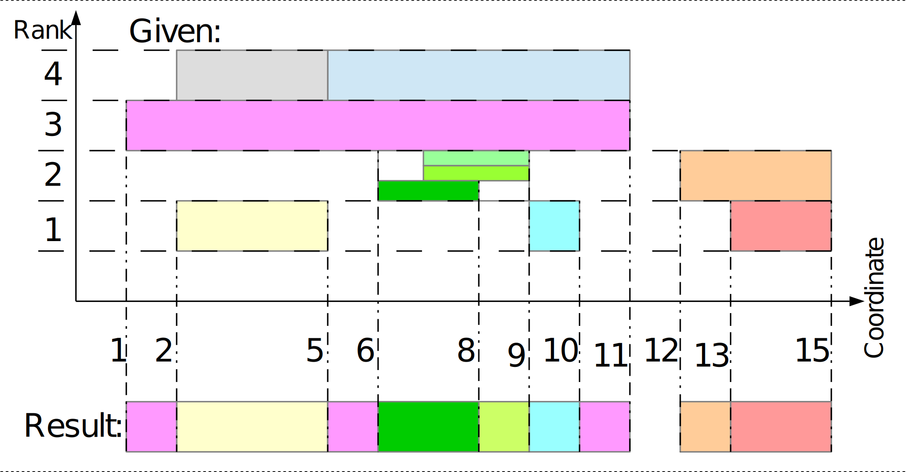

# Quiz: **Visible Slices**

## Task

Develop a *function* representing an algorithm to find non-overlapping “visible” parts of one-dimensional overlapping slices: “visibility” is defined by shadowing of higher-ranked slices by lower-ranked slices as it's shown on figure below:

## Function Specs

### Input arguments

The only **input argument** of the function is an array of `N` (`0 <= N <= 10**6`) object-type elements: `{start, end, rank}`, representing each given slice; where: `start`, `end` – integer coordinates: `-2**31 <= start < 2**31`, `-2**31 <= end < 2**31`, `start < end`; `rank` – integer rank: `-2**31 <= rank < 2**31`. Slices are provided in free order, so there is ***not necessary*** that `start` of next element is greater than or equal to `end` of the current one. Any overlapping slices with equal rank (i.e. “*all green*” on the figure) are “visible” in ascending order of their `start` values; and those with equal `start` values (i.e. “*pale green*” on the figure) – in ascending order of their indexes in the array.

### Return value

It should be an array of object-type elements:  `{start, end, in}`, representing non-overlapping slices, which are "visible" parts of given slices according to the task; where: `start`, `end` – integer coordinates: `start < end`; `in` – reference to an object of corresponding given slice. Array elements must be ordered by coordinates ascending, so that `start` of next element ***must be greater*** than  `start` of current one (same stands for `end` coordinates by definition).

## Solution

The current Git repository shall be cloned, and a single file `visible-slices.js` must be created and committed to `solution` branch. This file must be a module, compatible with *Node.js 14 LTS*. It must directly export the developed *function* and must not use third-party dependencies (must be “*vanilla JS*”; built-in modules allowed). The module shall be test-driven developed using ***Jest*** test file `visible-slices.test.js`. This file includes the case shown on figure above as `visible-slices: get visible slices`. If needed, custom test suites for Jest may also be created as files `*.test.js` and committed to `solution` branch.

The initial commit shall be created in `solution` branch **prior to start** of coding; it must be pushed to Git remote, and **draft** pull request must be created from it. Pull request must remain active during the development process.

## Algorithm

The developed algorithm should be optimized by execution time, memory consumption, and complexity of code. Ideally: the best case execution time complexity is to be `O(N log N)`, memory consumption complexity – `O(N)`; given Jest test suite in `visible-slices.test.js` is sufficient in coverage of all the algorithmic branches of minimal solution file. Built-in module `assert` may be used for assertion points to preserve the coverage. This test suite also includes `visible-slices: crash test`, which may help to ensure the stability and profile the performance on high loads.

## Submission

When the solution is ready, the draft pull request from `solution` branch must be marked as "**Ready for review**". The solution will be reviewed and evaluated in CI against more powerful test suites. Additional interview and requesting the changes may happen within the code review process for solution refinement.

## Assessment

Skill assessment includes: development cycle time and submission attempts; algorithm relevance, applicability, and optimization; code styling, linting, and commenting; respecting the Git-related development lifecycle requirements.

# Happy Coding!
